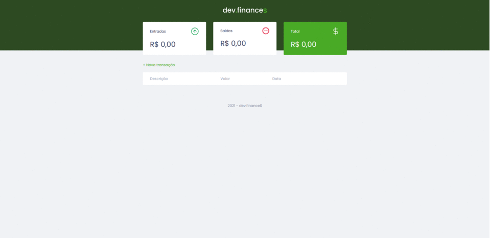

# MaratonaDiscover

# Projeto final da Maratona Discover pela Rocketseat

## Sobre o projeto

A Maratona Discover é um curso 100% gratuito que consiste em dominar desenvolvimento web desde os fundamentos e construir uma base sólida para decolar como programadora ou programador. Nessa edição, construímos uma aplicação financeira onde treinamos nossas habilidades com ferramentas como JavaScript, CSS, HTML, e durante o desenvolvimento, através das melhores práticas, entender conceitos importantes que vão ajudar a construir uma base sólida em programação.

## Preview

  

